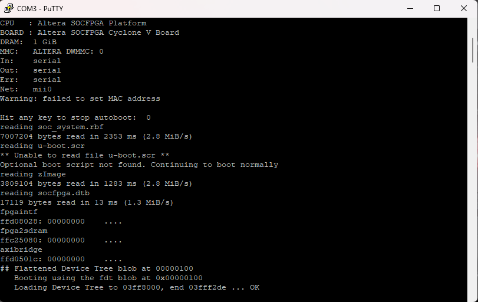
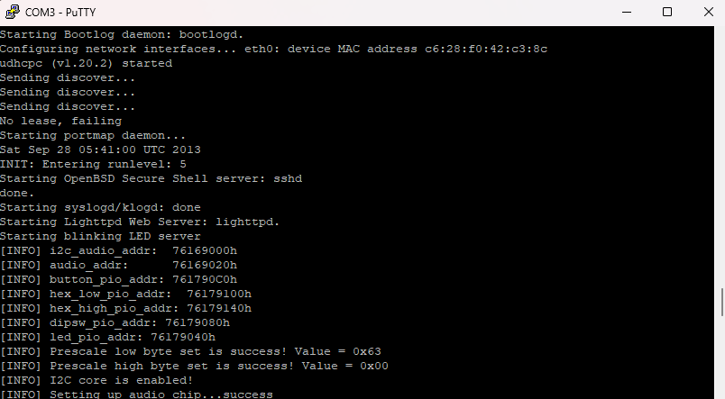
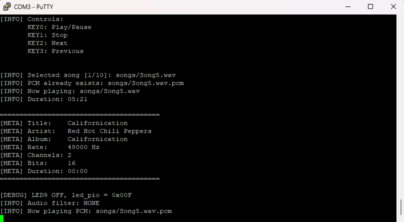

# Sistemas Empotrados - Proyecto II - Reproductor de Audio en DE1-SoC

Este proyecto implementa un sistema de reproducción de audio utilizando la tarjeta **DE1-SoC**, integrando lógica en FPGA, periféricos generados con **Platform Designer**, comunicación con el HPS mediante Linux embebido y una aplicación en C encargada de controlar la reproducción Y funcionalidades de archivos de audio.

---

## Requisitos

Para compilar, configurar y ejecutar el sistema se requiere lo siguiente:

* **Quartus Prime 18.1 Lite**
* **Platform Designer / Qsys**
* **SoC EDS 18.1**
* **PuTTY**
* Cliente `scp` para transferencia de archivos por SSH
* Tarjeta microSD (mínimo 4gb)
* Imagen Linux Console para DE1-SoC

La imagen de Linux Console para la tarjeta SD puede descargarse desde la página oficial de Terasic:

[Descargar imagen Linux Console para DE1-SoC](https://www.terasic.com.tw/cgi-bin/page/archive.pl?Language=English&CategoryNo=165&No=836&PartNo=4)

---

## Estructura general del sistema

El proyecto está compuesto por dos partes principales:

1. **Diseño de hardware en FPGA**

   * Proyecto en Quartus.
   * Sistema generado con Platform Designer.
   * Archivo `.qsys` con los periféricos y conexiones del sistema.
   * Archivo HDL generado para integrar el sistema al proyecto principal.
   * Asignación de pines de la DE1-SoC.
   * Compilación y programación de la FPGA.

2. **Software en C para Linux embebido**

   * Código fuente en C.
   * Archivo `Makefile`.
   * Binario generado llamado.
   * Ejecución desde la consola Linux de la DE1-SoC.

---

## Implementación del hardware

### 1. Abrir el proyecto en Quartus

Primero se debe abrir el proyecto principal en **Quartus Prime 18.1 Lite**. Este proyecto contiene la descripción de hardware utilizada para configurar la FPGA y conectar los periféricos necesarios para el funcionamiento del reproductor.

---

### 2. Abrir Platform Designer

Dentro del proyecto de Quartus se utiliza **Platform Designer** para definir el sistema de hardware. En este proyecto se cuenta con un archivo `.qsys`, el cual contiene los periféricos, componentes y conexiones necesarias entre el HPS y la lógica programable de la FPGA.

El archivo `.qsys` incluye la configuración de los componentes utilizados por el sistema, así como las conexiones entre buses, señales de control, periféricos y memoria mapeada.

---

### 3. Generar el HDL del sistema

Una vez revisado o modificado el diseño en Platform Designer, se debe generar el HDL correspondiente.

Para esto:

1. Abrir el archivo `.qsys` en Platform Designer.
2. Verificar que no existan errores de conexión.
3. Seleccionar la opción de generación del sistema.
4. Generar los archivos HDL.

Como resultado se genera el archivo necesario para integrar el sistema de Platform Designer dentro del proyecto de Quartus. Este archivo puede aparecer como un archivo HDL o como parte de los archivos generados, por ejemplo en formato `.qip`.

---

### 4. Agregar el archivo generado al proyecto de Quartus

Después de generar el sistema en Platform Designer, se debe agregar el archivo generado al proyecto de Quartus.

Normalmente se debe incluir el archivo `.qip` generado por Platform Designer en la lista de archivos del proyecto.

Esto se puede hacer desde:

```text
Project > Add/Remove Files in Project
```

Luego se selecciona el archivo correspondiente generado.

---

### 5. Asignar pines

Después de integrar el sistema generado, se deben asignar los pines correspondientes de la DE1-SoC.

La asignación de pines depende de los periféricos utilizados en el diseño, por ejemplo señales de audio, reloj, reset, buses, GPIOs u otras señales conectadas a la tarjeta.

La asignación se realiza desde el **Pin Planner** de Quartus.

---

### 6. Compilar el diseño

Una vez agregado el sistema generado y asignados los pines, se debe compilar el proyecto completo en Quartus.

Para esto se utiliza **Compile Design**.

Si la compilación finaliza correctamente, Quartus generará el archivo de programación necesario para cargar el diseño en la FPGA.

---

### 7. Programar la FPGA

Después de compilar el diseño, se debe programar la FPGA utilizando el USB-Blaster.

Para esto:

1. Conectar la DE1-SoC a la computadora mediante USB-Blaster.
2. Abrir el programador de Quartus.
3. Seleccionar el archivo `.sof` generado.
4. Presionar **Start** para programar la FPGA.

Una vez programada la FPGA, el hardware queda listo para ser utilizado por el software ejecutado desde Linux en el HPS.

---

## Preparación de la tarjeta SD

Para ejecutar el sistema desde la DE1-SoC, es necesario bootear la tarjeta con una imagen de Linux Console.

### 1. Descargar la imagen de Linux

La imagen puede descargarse desde la página oficial de Terasic:

[Descargar imagen Linux Console para DE1-SoC](https://www.terasic.com.tw/cgi-bin/page/archive.pl?Language=English&CategoryNo=165&No=836&PartNo=4)

Se debe seleccionar una imagen compatible con Linux Console para la DE1-SoC, para este caso se utilizó la imagen mínima de Linux Console.

---

### 2. Iniciar Linux en la FPGA

Con la tarjeta SD insertada, se enciende la DE1-SoC. Luego se utiliza **PuTTY** para conectarse por comunicación serial a la consola de Linux.

Desde PuTTY se debe seleccionar el puerto serial correspondiente y configurar la conexión según los parámetros usados por la imagen de Linux.

Una vez establecida la conexión, se debe iniciar sesión en la consola de Linux de la FPGA como usuario **root**.

---

## Configuración de red

Para transferir archivos hacia la FPGA se utiliza una conexión Ethernet y el comando `scp`.

Primero se puede asignar una dirección IP personalizada a la FPGA desde la consola Linux:

```bash
ifconfig eth0 <ip_fpga>
```

La computadora debe estar en la misma red que la FPGA para poder transferir archivos mediante `scp`.

---

## Compilación del software

El código del reproductor fue desarrollado en lenguaje C y cuenta con un archivo `Makefile` para facilitar la compilación.

Desde la consola EDS Embedded, se debe ingresar a la carpeta donde se encuentra el código fuente del programa.

Luego se ejecutan los siguientes comandos para compilar y generar el binario:

```bash
make clean
make
```

---

## Estructura de archivos en la FPGA

Una vez generado el ejecutable, este debe copiarse a la tarjeta SD o al sistema de archivos de Linux en la FPGA.

En este caso, `carpeta_music` debe contener las canciones en formato compatible, como `.wav` o `.pcm`.

Ejemplo de estructura:

```text
/home/root/
├── Ejecutable
└── carpeta_music/
    ├── song1.wav
    ├── song2.wav
    ├── song3.pcm
    └── song4.pcm
```

---

## Ejecución del sistema de forma Manual

Desde la consola Linux de la FPGA con PuTTY, se debe ingresar a la carpeta donde se encuentra el ejecutable:

```bash
cd /home/root
```

Si es necesario, se deben dar permisos de ejecución al binario:

```bash
chmod +x Ejecutable
```

Luego se ejecuta el sistema indicando como argumento la carpeta que contiene las canciones:

```bash
./Ejecutable carpeta_music
```

El programa tomará la carpeta indicada como entrada y utilizará los archivos de audio contenidos en ella para la reproducción.

---

## Programación automática de la FPGA y ejecución automática del reproductor

Además de programar la FPGA manualmente desde Quartus, el sistema puede configurarse para que la FPGA sea programada automáticamente durante el arranque mediante **U-Boot**. Posteriormente, Linux inicia el reproductor de forma automática mediante un script de arranque.

---

### Conversión de `.sof` a `.rbf`

El archivo `.sof` generado por Quartus se utiliza normalmente para programar la FPGA desde Quartus mediante JTAG. Sin embargo, para cargar el diseño desde U-Boot es necesario convertirlo a formato `.rbf`.

Desde la terminal de SoC EDS o desde una consola con acceso a las herramientas de Quartus, se debe ejecutar:

```bash
quartus_cpf -c -o bitstream_compression=off soc_system.sof soc_system.rbf
```

El parámetro:

```bash
-o bitstream_compression=off
```

se utiliza para generar un archivo `.rbf` sin compresión, compatible con la carga desde U-Boot en la DE1-SoC.

Una vez generado, el archivo:

```text
soc_system.rbf
```

debe copiarse en la partición de arranque de la tarjeta SD, donde se encuentran archivos como:

```text
zImage
socfpga.dtb
```

---

### Prueba manual de programación desde U-Boot

Antes de automatizar el proceso, se recomienda probar manualmente la carga del archivo `.rbf` desde U-Boot.

Al encender la DE1-SoC, se debe interrumpir el arranque automático presionando una tecla cuando aparezca el mensaje de U-Boot. Luego se ejecutan los siguientes comandos:

```bash
mmc rescan
fatload mmc 0:1 0x2000000 soc_system.rbf
fpga load 0 0x2000000 ${filesize}
boot
```

Estos comandos realizan lo siguiente:

1. `mmc rescan`: vuelve a detectar la tarjeta SD.
2. `fatload mmc 0:1 0x2000000 soc_system.rbf`: carga el archivo `.rbf` desde la partición de boot hacia memoria RAM.
3. `fpga load 0 0x2000000 ${filesize}`: programa la FPGA con el archivo cargado.
4. `boot`: continúa con el proceso normal de arranque de Linux.

Si la carga se realiza correctamente, Linux inicia con la FPGA ya programada.

---

### Configuración permanente de U-Boot

Una vez verificado que la programación manual funciona correctamente, se puede modificar la variable `bootcmd` de U-Boot para que la FPGA se programe automáticamente en cada arranque.

El comando utilizado fue:

```bash
setenv bootcmd 'mmc rescan; fatload mmc 0:1 0x2000000 soc_system.rbf; fpga load 0 0x2000000 ${filesize}; run callscript; run mmcload; run bridge_enable_handoff; run mmcboot'
```

Luego se prueba el nuevo comando de arranque sin guardarlo todavía:

```bash
run bootcmd
```

Si el sistema arranca correctamente, se guarda la configuración de U-Boot:

```bash
saveenv
```

Con esta configuración, cada vez que la tarjeta inicia, U-Boot carga automáticamente `soc_system.rbf`, programa la FPGA y luego continúa con el arranque de Linux.

Resultado esperado:

| | 

---

## Ejecución automática del Reproductor de audio

Para que el reproductor se ejecute automáticamente al iniciar Linux, se creó un script dentro de `/etc/init.d`.

El script se genera con los siguientes comandos:

```bash
echo '#!/bin/sh' > /etc/init.d/myplayer
echo 'cd /home/root || exit 1' >> /etc/init.d/myplayer
echo 'sleep 5' >> /etc/init.d/myplayer
echo './MyPlayer songs' >> /etc/init.d/myplayer
chmod +x /etc/init.d/myplayer
```

Este script realiza lo siguiente:

1. Entra al directorio `/home/root`.
2. Espera unos segundos para permitir que el sistema termine de iniciar.
3. Ejecuta el reproductor con la carpeta `songs`:

```bash
./MyPlayer songs
```

---

### Agregar el script al arranque de Linux

Para que el script se ejecute automáticamente al iniciar Linux, primero se revisan los directorios de arranque disponibles:

```bash
ls /etc/rc*.d
```

En este sistema se utilizó el runlevel 5, por lo que se agregó un enlace simbólico en `/etc/rc5.d`:

```bash
ln -s /etc/init.d/myplayer /etc/rc5.d/S99myplayer
```

Para verificar que el enlace fue creado correctamente:

```bash
ls -l /etc/rc5.d/S99myplayer
```

Con esto, al finalizar el arranque de Linux, se ejecuta automáticamente el script `myplayer`, iniciando la reproducción de audio sin necesidad de ingresar manualmente el comando.

Resultados esperados:


| |  |


---

## Flujo final de arranque automático

El flujo completo del sistema queda de la siguiente forma:

```text
Encendido de la DE1-SoC
        ↓
U-Boot inicia
        ↓
U-Boot carga soc_system.rbf desde la partición boot
        ↓
U-Boot programa la FPGA
        ↓
Se ejecutan los comandos normales de arranque de Linux
        ↓
Linux inicia
        ↓
Se ejecuta /etc/init.d/myplayer desde rc5.d
        ↓
MyPlayer inicia automáticamente con la carpeta songs
        ↓
El sistema queda reproduciendo audio y listo para controlarse con botones y switches
```

---
## Funcionalidades desarrolladas

### Control de la Reproducción
El sistema cuenta con las funcionalidades principales de un reproductor de audio básico, permitiendo controlar la reproducción directamente desde los botones físicos de la tarjeta **DE1-SoC**. Estas funciones permiten interactuar con la lista de canciones almacenada en la carpeta indicada al ejecutar el programa.


| Botón  | Funcionalidad | Descripción                                                                                                                                                       |
| ------ | ------------- | ----------------------------------------------------------------------------------------------------------------------------------------------------------------- |
| `KEY0` | Play / Pause  | Permite iniciar la reproducción de una canción o pausarla temporalmente. Si la canción está pausada, al presionar nuevamente el botón se reanuda la reproducción. |
| `KEY1` | Stop          | Detiene la reproducción actual.                                                                                                                                   |
| `KEY2` | Next          | Cambia a la siguiente canción disponible dentro de la carpeta de música.                                                                                          |
| `KEY3` | Previous      | Regresa a la canción anterior dentro de la lista de reproducción.                                                                                                 |

### Selección de filtros mediante switches

El sistema permite seleccionar filtros digitales de audio mediante los switches físicos `SW0` a `SW3` de la DE1-SoC. Estos filtros fueron implementados por software en el procesador HPS, procesando las muestras PCM antes de enviarlas al hardware de audio en la FPGA.

| Switch | Filtro | Descripción |
| ------ | ------ | ----------- |
| `SW0` | Reverberación | Aplica un efecto de reverberación al audio, generando una sensación de eco o persistencia del sonido. |
| `SW1` | Filtro pasa-banda | Permite conservar principalmente una banda específica de frecuencias, atenuando frecuencias más bajas y más altas fuera de esa banda. |
| `SW2` | Filtro pasa-altos | Atenúa las frecuencias bajas y permite el paso de frecuencias altas. |
| `SW3` | Filtro pasa-bajos | Atenúa las frecuencias altas y permite el paso de frecuencias bajas. |

Cuando todos los switches `SW0` a `SW3` están apagados, el sistema trabaja en modo normal, sin aplicar filtros al audio. En este caso se utiliza el modo `AUDIO_FILTER_NONE` o bypass.

Si se activa más de un switch al mismo tiempo, el sistema utiliza un orden de prioridad para seleccionar el filtro activo.

### Indicador de filtro activo

El sistema utiliza el LED `LEDR9` como indicador visual del estado de los filtros.

| LED | Estado | Descripción |
| --- | ------ | ----------- |
| `LEDR9` | Encendido | Indica que alguno de los filtros digitales está activo. |
| `LEDR9` | Apagado | Indica que no hay filtros activos y el audio se reproduce en modo normal o bypass. |

---

Estas funcionalidades permiten que el usuario controle el sistema sin necesidad de ingresar comandos adicionales desde la consola una vez que el programa se encuentra en ejecución. De esta manera, la interacción principal con el reproductor se realiza mediante los botones y switches físicos de la FPGA.


